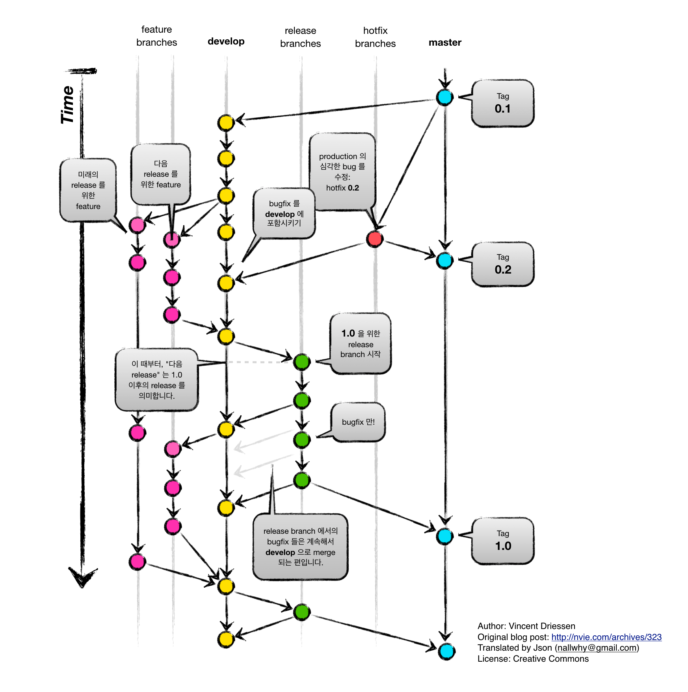

## Git이 DevOps 업무에서 중요한 이유는 무엇인가요?

---

Git은 소프트웨어 개발에서 소스 코드의 변경 사항을 추적하고 여러 개발자들이 함께 작업을 할 수 있도록 하는 분산 버전 관리 시스템입니다.

Git은 DevOps 업무에서 중요한 도구로 다음과 같은 이유들 떄문에 중요합니다.

1. 버전관리 : Git은 코드의 버전 관리를 가능하게 합니다. 코드의 변화를 시간에 따라 추적하고 이전 버전으로 롤백하거나 문제를 디버깅하는데 도움이됩니다.
2. 협업 : Git을 사용하면 여러 개발자들이 동시에 같은 코드베이스에서 작업할 수 있습니다. 각 개발자는 자신의 로컬 브랜치에서 작업하고, 작업이 완료되면 메인 브랜치에 병합(Merge) 할 수 있습니다.
3. 빠른 피드백 : Git의 브랜치와 풀 리퀘스트 기능을 이용하면 코드 리뷰 과정을 자동화하고 빠르게 피드백을 제공할 수 있습니다.
4. CI/CD 파이프라인과의 통합 : Git은 지속적 통합과 지속적 배포 도과와 잘 통합됩니다.
5. 소스 코드의 안정성 : Git을 사용하면 소스코드의 안정성이 확보됩니다. 모든 변경 사항이 추적되고, 문제가 발생하면 쉽게 이전 상태로 롤백할 수 있습니다.

## 개발과 스테이징, 프로덕션을 구분하기 위해 브랜치 전략을 어떻게 짜면 좋을까요?

---

개발, 스테이징, 프로덕션 환경을 구분하기 위한 브랜치 전략을 설계하는 것은 프로젝트의 규모, 복잡성, 팀의 요구사항에 따라 다르지만, 일반적인 전략 중 하나는 Git-Flow 방식을 이용하는 것입니다.

Git-flow에는 5가지 종류의 브랜치가 존재합니다. 항상 유지되는 메인 브랜치들(master, develop)과 일정 기간 동안만 유지되는 보조 브랜치들(feature, release, hotfix)이 있습니다.

- master : 제품으로 출시될 수 있는 브랜치
- develop(dev) : 다음 출시 버전을 개발하는 브랜치
- feature(feat) : 기능을 개발하는 브랜치
- release : 이번 출시 버전을 준비하는 브랜치
- hotfix : 출시 버전에서 발생한 버그를 수정하는 브랜치.

[강남언니 공식 블로그](https://blog.gangnamunni.com/post/understanding_git_flow/)

[우아한 기술 블로그](https://techblog.woowahan.com/2553/)
